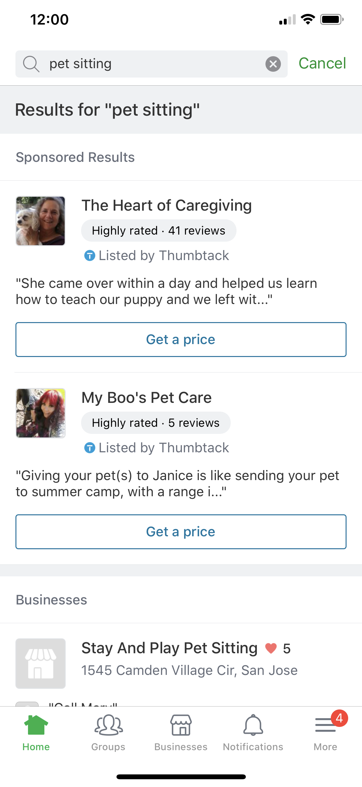
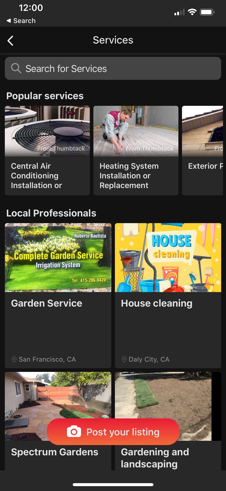

# Introduction

The purpose of Thumbtack's Partner API is to enable Partners to seamlessly serve Thumbtack content on Partner
platforms. Currently, the content being served by the API includes information about Thumbtack categories and Pros.
However, our API is under active development, so we are constantly adding more content to the API upon request.  

Partners currently need approval to integrate with us. To request approval, feel free to reach out to us at teampartnerships AT thumbtack DOT com

Your use of our API is subject to Thumbtack's <a href='#api-terms-of-use'>API Terms of Use</a>.

# Partnership Mechanics

1. Partners show Thumbtack content (Pros and/or categories) on their platforms.   
2. Thumbtack provides links for each piece of content. These links contain partner tracking information, which allow
Thumbtack to attribute the Partner's users to the Partner.  
3. By clicking the Thumbtack content, the Partner's users are directed to Thumbtack.   
4. When a Partner's user contacts a Pro on Thumbtack, the associated revenue is shared with the Partner.  

# Spotlight
## Nextdoor



## News Break

<div id="nb_images" style="display:flex; margin-right:50%">
    
    
</div>

# Authentication

> To authorize, use this code:

 ```shell
 # With shell, you can just pass the correct header with each request
 curl "api_endpoint_here"
    -H "Authorization: AUTH_HEADER"
```

> Make sure to replace `AUTH_HEADER` with your personal header.
 
Where applicable, APIs use HTTP basic access authentication. Thumbtack will provide Partners with a username
and password. The basic header looks as follows:

`Authorization: Basic <encoding>`

`<encoding>` is the base64 encoding of the username followed by a colon, followed by the password.

Thumbtack will provide Partners with two sets of credentials - one for Thumbtack's test environment and 
one for Thumbtack's production environment.

# Endpoints

Thumbtack exposes the following endpoints for Partners. 
All endpoints are versioned to support future schema changes. 
Endpoints will use HTTP basic access authentication, and Thumbtack will provide 
Partners with username and password for Partners to call these endpoints.

## Pros

> Sample Request

```shell
curl https://api.thumbtack.com/v1/partners/discoverylite/pros?category=<category>&zip_code=<zip_code>&utm_source=<utm_source>
  -H "Authorization: AUTH_HEADER"
  -H "Content-Type:application/json"   
OR 
 curl https://api.thumbtack.com/v1/partners/discoverylite/pros?category_pk=<category_pk>&zip_code=<zip_code>&utm_source=<utm_source>
  -H "Authorization: AUTH_HEADER"
  -H "Content-Type:application/json" 
```

> The above command returns JSON structured like this:

```json
{
   "results":[
      {
         "service_id":"340819324875669527",
         "business_name":"José Daniel Ramirez Vazquez",
         "rating":4.541666666666667,
         "num_reviews":24,
         "years_in_business":5,
         "num_hires":36,
         "thumbtack_url": "https://www.thumbtack.com/ca/el-sobrante/furniture-refinishing/jos-daniel-ramirez-vazquez/service/281762703885780102?utm_source=<partnerID>",
         "image_url": "https://d1vg1gqh4nkuns.cloudfront.net/i/345226232596922395/desktop/standard/thumb",
         "background_image_url": "https://production-next-images-cdn.thumbtack.com/i/323234489549873159/small/standard/hero",
         "featured_review": "José was very thorough in his inspection of our new home.  His report was very helpful.  Thanks, Mike!",
         "quote": {
            "starting_cost": 15000
         },
        "introduction": "We opened our services a few years ago and strive to deliver only the best experience and quality for our clients.",
        "pills": [
          "licensed",
          "remote",
          "popular"
        ],
        "location": "Mountain View, CA",
        "similar_jobs_done": 6,
        "license_verified": true,
        "num_of_employees": 2,
        "has_background_check": true
      },
      {
         "service_id":"327730960171982897",
         "business_name":"HandiTechGuy -Kevin Jacob",
         "rating":4.433333333333334,
         "num_reviews":30,
         "years_in_business":6,
         "num_hires":38,
         "thumbtack_url": "https://www.thumbtack.com/ca/corte-madera/electricians/handitechguy-kevin-jacob/service/351982634073939991?utm_source=<partnerID>",
         "image_url": "https://d1vg1gqh4nkuns.cloudfront.net/i/351984685684138006/desktop/standard/thumb",
         "background_image_url": "https://production-next-images-cdn.thumbtack.com/i/323234489549873159/small/standard/hero",
         "featured_review": "Kevin is the most thorough, knowledgeable and friendly home inspector. He leaves no details out and responded to my inquiries super quickly.",
         "quote": {
            "starting_cost": 20000
         },
        "introduction": "Efficient and professional cleaning.  Attentive to customer needs and their peculiarities. \nPet friendly 🐶🐱 Eco-friendly 🍀🌳",
        "pills": [
          "low_price",
          "remote",
          "popular"
        ],
        "location": "Mountain View, CA",
        "num_of_employees": 3,
        "has_background_check": true
      },
      ...
  ]
}

```

This endpoint is used to fetch a list of Thumbtack Pros for a given market. Markets are defined to be the combination
of a category and a zip code. Thumbtack will handle query translation for the Partner such that the Partner can provide
free form text as the category and Thumbtack will convert the provided text to the corresponding Thumbtack category. 
If a Partner does not have a query, they can directly provide the category name as the query.

Parameters for the endpoint will be passed in as URL query parameters.

### Parameters (passed in via URL)

Parameter | Type | Description | Required
--------- | ---- | ----------- | --------
category | string | Query string the user is searching for | N
category_pk | string | PK of the category that you received as a part of homecare/checklist API  | N
zip_code | string | Zip code the user is located in | Y
utm_source | string | Partner ID for attribution purposes | Y

**Note:**
In each request atlas one category specific parameter should be available. Either category or category_pk.
* If you are using /category API then pass a category with valid value in request.
* If you are using /homecare/checklist API then pass category_pk with valid PK in the request.


### HTTP Endpoint (Production Environment)

`GET https://api.thumbtack.com/v1/partners/discoverylite/pros?zip_code=<zip_code>&category=<category>&utm_source=<utm_source>`

### HTTP Endpoint (Test Environment)

`GET https://staging-pro-api.thumbtack.com/v1/partners/discoverylite/pros?zip_code=<zip_code>&category=<category>&utm_source=<utm_source>`

### Response

Thumbtack will provide a JSON response that contains the following fields.

Parameter | Type | Description | Required
--------- | ---- | ----------- | --------
results | array | Array of Thumbtack Pros | Y
results.service_id | string | Thumbtack ID of the Pro's business | Y
results.business_name | string | Name of the Thumbtack Pro's business | Y
results.rating | number | Rating (1-5 scale) of the Pro | Y
results.num_reviews | number | Number of reviews the Pro has on Thumbtack | Y
results.years_in_business | number | Number of years the Pro has been in business | N
results.num_hires | number | Number of times the Pro has been hired on Thumbtack | N
results.thumbtack_url | string | Thumbtack URL for the Pro | Y
results.image_url | string | Image URL for the Pro's Thumbtack profile | Y
results.background_image_url | string | Background Image URL for the Pro's Thumbtack profile | Y
results.featured_review | string | Review text Thumbtack has chosen to highlight about the Pro | N
results.quote | object | Information around the cost of the job | N
results.quote.starting_cost | number | The tentative cost of the quote in cents, given that we have minimal information about the customer’s request | N
results.quote.cost_unit | string | The unit of measurement corresponding to the starting_cost. May be temporal (“Hour”), non-temporal (“Dog”, “Session”, “Visit”, “sq ft”, etc.), or omitted if starting_cost is a flat rate | N
results.introduction | string | Introduction of the Thumbtack Pro's business | Y
results.ProfilePill | array | Profile pills for the Thumbtack Pro's business | Y
results.location | string | Location of the Thumbtack Pro's business | N
results.is_top_pro | boolean | Is Thumbtack Pro is top pro or not? | N
results.similar_jobs_done | number | Number if similar jobs done by Thumbtack Pro's | N
results.license_verified | boolean | Is licence verified for the Thumbtack Pro's business? | N
results.num_of_employees | number | Number of employees in the Thumbtack Pro's business | N
results.has_background_check | boolean | Has background check is done for the Thumbtack Pro's business? | N

### Profile Pills
Profile pill name are converted into label on the Thumbtack website. 
Below table shows the profile pill to label mapping.

Profile Pill Name | Label 
----------------- | -------
popular | In high demand 
licensed | Licensed pro 
low_price | Great Value 

## Categories

> Sample Request

```shell
curl https://api.thumbtack.com/v1/partners/discoverylite/categories?zip_code=<zip_code>&utm_source=<utm_source>
  -H "Authorization: AUTH_HEADER"
  -H "Content-Type:application/json" 
```

> The above command returns JSON structured like this:

```json
{
   "results":[
      {
         "categoryName":"air_conditioning_installation_replacement",
         "categoryDisplayName":"Central Air Conditioning Installation or Replacement",
         "activeServices":21,
         "url":"https://thumbtack.com/k/air-conditioner-installation/near-me?utm_source=test&utm_medium=partnership",
         "imageURL":"https://production-next-images-cdn.thumbtack.com/i/327878539097268344/small/standard/hero",
      },
      {
         "categoryName":"exterior_painting",
         "categoryDisplayName":"Exterior Painting",
         "activeServices":15,
         "url":"https://thumbtack.com/k/exterior-painting/near-me?utm_source=test&utm_medium=partnership",
         "imageURL":"https://production-next-images-cdn.thumbtack.com/i/323468071300677642/small/standard/hero",
      },
      ...
  ]
}

```

This endpoint is used to fetch a list of Thumbtack Categories for a given zip code. This endpoint is useful if there
does not yet exist a search query and the Partner merely wants to showcase the variety of categories Thumbtack 
actively supports. 

Parameters for the endpoint will be passed in as URL query parameters.

### Parameters (passed in via URL)

Parameter | Type | Description | Required
--------- | ---- | ----------- | --------
zip_code | string | Zip code the user is located in | Y
utm_source | string | Partner ID for attribution purposes | Y


### HTTP Endpoint (Production Environment)

`GET https://api.thumbtack.com/v1/partners/discoverylite/categories?zip_code=<zip_code>&utm_source=<utm_source>`

### HTTP Endpoint (Test Environment)

`GET https://staging-pro-api.thumbtack.com/v1/partners/discoverylite/categories?zip_code=<zip_code>&utm_source=<utm_source>`

### Response

Thumbtack will provide a JSON response that contains the following fields.

Parameter | Type | Description | Required
--------- | ---- | ----------- | --------
results | array | Array of Thumbtack categories | Y
results.categoryName | string | Name of the category (can use this category name as the `category` query param for the aforementioned Pros endpoint) | Y
results.categoryDisplayName | string | The category name to display to users | Y
results.activeServices | number | Number of active Thumbtack Pros for the category and zip code (null means that we can not get the number of active services for the (category, zip code) combination) | Y
results.url | string | Thumbtack URL for the category | Y
results.imageURL | string | Thumbtack image URL for the category | Y

## Homecare/checklist

> Sample Request

```shell
curl --location --request GET 'https://pro-api.thumbtack.com/v1/partners/discoverylite/homecare/checklist?zip_code=96061&property_type=single_family_home&utm_source=cma-foxy'
  -H 'Authorization: AUTH_HEADER'
  -H "Content-Type:application/json" 
```

> The above command returns JSON structured like this:

```json
{
  "results": [
    {
      "taskDetails": {
        "title": "Clean gutters",
        "description": "Clogged gutters can lead to major flooding and damage that come at a high cost for homeowners. Routine upkeep can be vital in redirecting water away from your home, which helps prevent leaks, damage to your roof or water accumulating against your foundation. \n\nNeglecting to clean out your gutters can lead to a host of issues including basement flooding, overflow coming through your roofing and in cold climates ice damming, which can cause damage and even more leaks. These are issues that generally stem from more than one season of neglect, but should be taken seriously as any flooding or leak damage can cost thousands.",
        "tagline": "PREVENTS_FLOODING",
        "avgCost": {
          "max": 300,
          "min": 100
        }
      },
      "categoryPK": "124317070955717033",
      "taskPK": "422486850908987417",
      "categoryName": "gutter cleaners",
      "categoryDisplayName": "Gutter Cleaning and Maintenance",
      "activeServices": null,
      "url": "https://d.thumbtack.com/k/gutter-cleaners/near-me?utm_source=cma-foxy&utm_medium=partnership",
      "imageURL": "https://staging-next-images-cdn.thumbtack.com/i/323234414494916677/small/standard/hero"
    },
    {
      "taskDetails": {
        "title": "Overseed and aerate lawn",
        "description": "Getting a beautiful lawn next year means doing some work now. Aerating allows nutrients to penetrate the soil, which enhances seed germination. Overseeding will also improve the coverage and thickness of the lawn while also reducing weeds.",
        "tagline": "IMPROVES_YOUR_HOME",
        "avgCost": {
          "max": 80,
          "min": 40
        }
      },
      "categoryPK": "240123621172183344",
      "taskPK": "422486850926174234",
      "categoryName": "lawn care",
      "categoryDisplayName": "Full Service Lawn Care",
      "activeServices": null,
      "url": "https://d.thumbtack.com/k/lawn-care/near-me?utm_source=cma-foxy&utm_medium=partnership",
      "imageURL": "https://staging-next-images-cdn.thumbtack.com/i/323632148692721733/small/standard/hero"
    },
    …
  ]
}
```

This endpoint is used to fetch a list of Thumbtack Categories and Task Details for a given zip code and property type. 
This endpoint is useful if there does not yet exist a search query and the 
Partner merely wants to showcase the variety of categories Thumbtack actively supports.

Parameters for the endpoint will be passed in as URL query parameters.

### Parameters (passed in via URL)

Parameter | Type | Description | Required
--------- | ---- | ----------- | --------
zip_code | string | Zip code the user is located in | Y
property_type | string | Pass valid property type from the list provided below. | Y
utm_source | string | Partner ID for attribution purposes | Y

#### PROPERTY TYPES:
* UNKNOWN
* APARTMENT
* SINGLE_FAMILY_HOME
* COMMERCIAL
* TOWNHOUSE
* MULTI_FAMILY
* OTHER

### HTTP Endpoint (Production Environment)

`GET https://pro-api.thumbtack.com/v1/partners/discoverylite/homecare/checklist?zip_code=<zip_code>&utm_source=<utm_source>&property_type=<property_type>`

### HTTP Endpoint (Test Environment)

`GET https://staging-pro-api.thumbtack.com/v1/partners/discoverylite/homecare/checklist?zip_code=<zip_code>&utm_source=<utm_source>&property_type=<property_type>`

### Response

Thumbtack will provide a JSON response that contains the following fields.

Parameter | Type | Description | Required
--------- | ---- | ----------- | --------
results | array | Array of Thumbtack categories | Y
results.taskDetails | object | Task details json block | Y
results.taskDetails.title | string | Title of the task | Y
results.taskDetails.description | string | Description of the task | Y
results.taskDetails.tagline | string | Tagline of the task | Y
results.taskDetails.avgCost | json | Cost json block of the task | Y
results.taskDetails.avgCost.max | number | Maximum cost of the task | Y
results.taskDetails.avgCost.min | number | Minimum cost of the task | Y
results.categoryPK | string | PK of the category (can use this category_pk as the category query param for the aforementioned Pros endpoint) | Y
result.taskPK | string | PK of the task | Y
results.categoryName | string | Name of the category (can use this category name as the `category` query param for the aforementioned Pros endpoint) | Y
results.categoryDisplayName | string | The category name to display to users | Y
results.activeServices | number | Number of active Thumbtack Pros for the category and zip code (null means that we can not get the number of active services for the (category, zip code) combination) | Y
results.url | string | Thumbtack URL for the category | Y
results.imageURL | string | Thumbtack image URL for the category | Y

#### Response Size
10 categories in result

# Contact Us

If you have any questions, feel free to reach out to us at teampartnerships AT thumbtack DOT com
